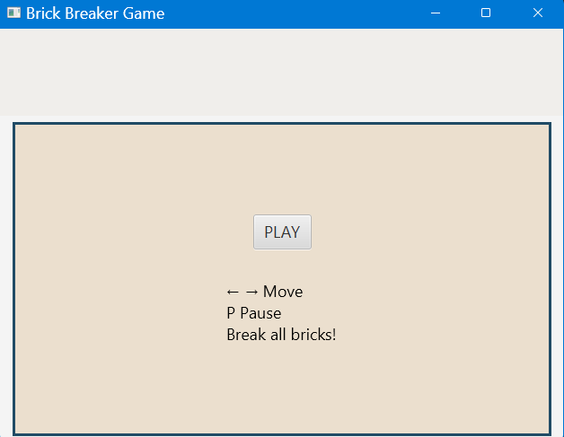
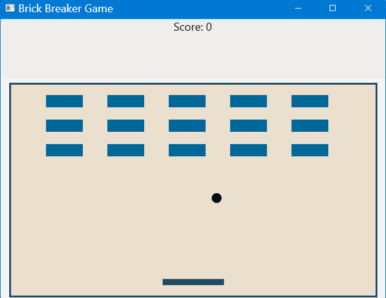
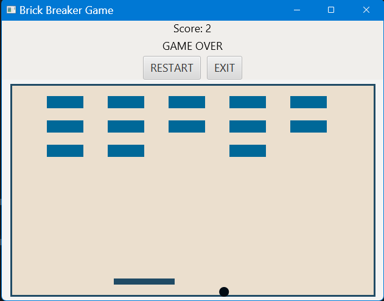
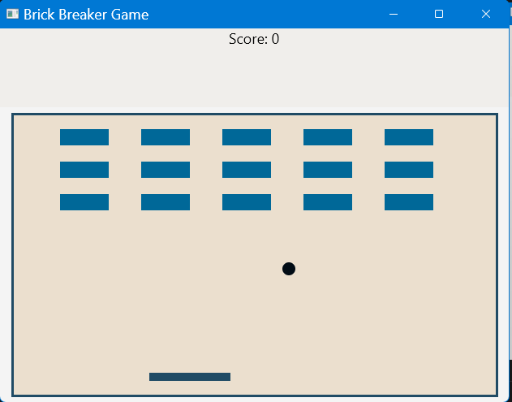
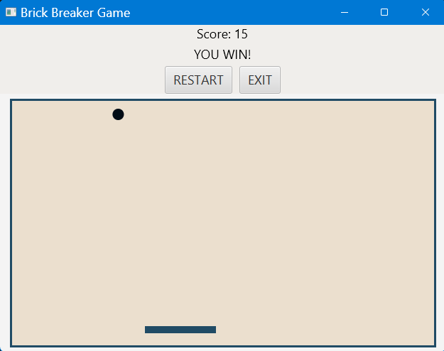

# 🎮 Brick Breaker Game (JavaFX)

## Overview

This is a classic Brick Breaker game built using **Core Java and JavaFX**.
The player controls a paddle to bounce a ball and break all bricks.

---

## Features

* Paddle movement using keyboard
* Real-time ball physics and collision detection
* Brick breaking mechanics
* Score tracking
* Pause / Resume functionality
* Restart and Exit options
* Win and Game Over states
* Clean UI with structured layout

---

## Technologies Used

* Java (Core Java)
* JavaFX (GUI)
* IntelliJ IDEA
* Git & GitHub

---

## Controls

* Left Arrow → Move paddle left
* Right Arrow → Move paddle right
* P → Pause / Resume game

---

## How to Run

### Run using IntelliJ

* Open project
* Run `GameApplication.java`

### Run using JAR (Command Line)

```bash
java --module-path "C:\Program Files\javafx-sdk-26\lib" --add-modules javafx.controls,javafx.fxml -jar yourProjectName.jar
```

---

## What I Learned

* JavaFX UI development
* Event handling and game loops
* Collision detection logic
* Structuring UI using layouts (BorderPane, VBox, StackPane)
* Debugging real-world UI issues
* Packaging Java applications

---

## Screenshots

### Start


### Play


### Game Over


### Restart Over


### Game Win



---

##  Author

[Prathamesh Kakde](https://github.com/prathameshkakde)

---
> ## Note
> This project idea is inspired by an [article](https://www.geeksforgeeks.org/blogs/java-projects/#:~:text=2.%20Brick%20Breaker%20Game) from [GeeksforGeeks](https://www.geeksforgeeks.org/) and showcases the following key concepts:
> * Backend development
> * API integration
> * Database usage
> * Frontend interaction

---